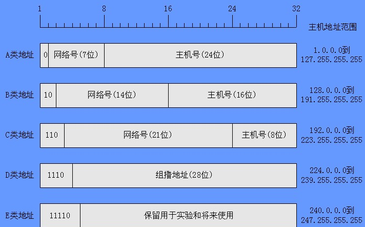

### ip地址的组成（网络位+主机位）

**IP地址采用分层结构；**

IP地址是由网络号（net ID）与主机号（host ID）两部分组成的。

**根据不同的取值范围，IP地址可以分为五类**；IP地址中的前5位用于标识IP地址的类别：

```
A类地址的第一位为0；  127 => 0(128)1(64)1(32)1(16) 1(8)1(4)1(2)1(1)
网络位7(8-1)位，主机号24位(32-7-1 = 24)

B类地址的前两位为10； 191 => 1(128)0(64)1(32)1(16) 1(8)1(4)1(2)1(1)
网络位14(8+8-2)位，主机号16位(32-14-2 = 16)

C类地址的前三位为110；223 => 1(128)1(64)0(32)1(16) 1(8)1(4)1(2)1(1)
网络位21(8+8+8-3)位，主机号位(32-21-3 = 8)

D类地址的前四位为1110；
E类地址的前五位为11110；
```


实际大多通过`子网掩码`来区分网络位和主机位，子网掩码跟IP地址一一对应，子网掩码为1的是网络位，为0的是主机位。
如：192.168.1.2 掩码255.255.255.0 。网络位192.168.1 主机位是2

举个例子：比如172.16.2.160/255.255.255.0

这个IP地址的【网络号】就是172.16.2.0 主机号为   0.0.0.160 

> 划分子网情况

```
如：172.16.2.160/255.255.255.192(IP地址/掩码)

1010   1100   0001   0000   0000   0010   1010   0000   (二进制)

1111   1111   1111   1111   1111   1111   1100   0000  （子网掩码）

------------------------------------------相"与"(理解成相乘）

1010   1100   0001   0000   0000   0010   1000   0000（172.16.2.128这就是子网号）

1010   1100   0001   0000   0000   0010   1000   0001（172.16.2.129是第一个主机）

1010   1100   0001   0000   0000   0010   1011   1110（172.16.2.190最后一个主机）

1010   1100   0001   0000   0000   0010   1011   1111   广播地址  172.16.2.191 

个人的理解:
通过ip二进制和子网掩码二进制"与"可以发现，子网掩码二进制 1 的部分代表"网络位", 0 的部分代表"主机位"，
上面的例子可以看出"主机位"有6位，那么最后一段8位前两位是定的10，所以"第一个主机位"是1000 0001，"最后一个主机位"是1011 1110，因为还要留一个"广播地址"1011 1111。 
```

> 子网掩码的作用：

1. 将一类ip地址（也就是只确定的网络号的ip）划分为更加小的子网络(`通常得到一个c类ip,如：212.26.220.0最后一组是主机号（最大255），用子网掩码分成更小的网段`）

```
因为掩码的值是连续的1，那么子网掩码的值也就是有规律的：
比如
1000 0000 ---> 128
1100 0000 ---> 192
1110 0000 ---> 224
1111 0000 ---> 240
1111 1000 ---> 248
1111 1100 ---> 252
1111 1110 ---> 254
```

2. 将相邻的网络地址合并成同一逻辑网络

```
两个C类IP地址215.60.30.0与215.60.31.0与子网掩码255.255.254.0
11010111.00111100.00011110.00000000-->215.60.30.0
11010111.00111100.00011111.00000000-->215.60.31.0
11111111.11111111.11111110.10000000-->255.255.254.0//掩码
11010111.00111100.00011110.00000000-->215.60.30.0//都是该网段
```

注意：一个错误的理解：子网掩码主要目的是增加了ip数量！！！其实并没有增加！！！（`也不能说没有增加，比如相同的ip不同子网掩码，实际公网是不存在相同的ip,如果说是两个局域网这种情况，不知道算不算增加了`）

补充：

* 只知道ip地址那么只能知道是属于哪一类ip。或者认为没有子网络，比如c类ip，那么前3组是网络号，后面一组是主机号

* 只有知道子网掩码和ip，才能知道具体的网段和主机号

* 相同子网掩码未必是同一网段ip,同一网段的ip必然有相同的子网掩码。


> “IP地址/ 数字” 是什么意思？例如 192.168.5.12 / 21

数字是子网掩码位（数），说明子网掩码由21个1组成，即 子网掩码是：
```
11111111 11111111 11111000 00000000  ，也就是255.255.248.0
```

[文章链接](http://t.zoukankan.com/straybirds-p-5319604.html)

### 子网掩码(网络掩码)的位数

255.255.255.0  => / 24

1111 1111 1111 1111 1111 1111 0000 0000  = 24（总长32，1算，0不算）

#### 已知IP地址和子网掩码,如何快速计算是否在同一网段(仍待验证)

下面哪些IP位于同一子网中？

* 192.168.78.36/29
* 192.168.78.42/29
* 192.168.78.41/29
* 192.168.78.45/29
* 192.168.78.48/29

```
通过上面子网掩码29位，我们可以知道 网络位是29位，主机位3位。所以，判断是否同一网段，看"网络位"是否相同。
因为前面都是相同的，所以看最后一段的数字二进制8位扣除3位"主机位"后是否相同。

36 (2 +4)                      0010 0100   =>  0010 0 (扣除3位主机位)

42  (32 + 8 + 2)             0010 1010    => 0010 1

41  (32 + 8 + 1)              0010 1001    => 0010 1

45  (32 + 8 + 4 +1)         0010 1101    =>  0010 1

48  (32 + 16)                  0011  0000   => 0011  0

可以看出 42 41 45在同一网段

那么快速的方法
主机位3位： 2^3 = 8
36/8 = 4
42/8 = 5
41/8 = 5
45/8 = 5
48/8 = 6
```

下面哪些IP位于同一子网中？
* 192.168.165.24/255.255.254.0 和 192.168.164.78/255.255.254.0
* 192.168.165.24/255.255.255.255 和 192.168.164.78/255.255.255.255

```
第一组计算:
255.255.254.0        2^9  =  256

16524 / 256 = 64.5

16478 / 256  = 64.3

商64，相同

第二组计算:
255.255.255.255  2^8 = 128

16524/128 = 129

16478/128 = 128.7

商129和128，不相同
```

[文章地址-还有其他知识点哦](https://mp.weixin.qq.com/s/VmXgt6usAfPKyfmsAM_UZg)

### IP地址、子网掩码、网段、网关的关系

IP地址、子网掩码、网络地址、广播地址、网段、网关的关系,例：

|name |终端A	|终端B	|终端C|
|---- |--- | --- | ---|
|IP地址	|192.168.1.10	|192.168.1.23	|192.168.1.40|
|子网掩码	|255.255.255.224	|255.255.255.224	|255.255.255.224|
|网络地址	|192.168.1.0	|192.168.1.0	|192.168.1.32|
|广播地址	|192.168.1.31	|192.168.1.31	|192.168.1.63|
|网段	|192.168.1.0~192.168.1.31	|192.168.1.0~192.168.1.31	|192.168.1.31~192.168.1.63|
|网关	|192.168.1.1	|192.168.1.1	|192.168.1.32|

> 总结：

* 网络地址=IP地址&子网掩码
* 广播地址=IP地址|（！子网掩码）
* 网段：网络地址相同的IP地址属于同一网段，即同一子网。
* 网关：同一网段（子网）间终端可直接通信，如终端A和终端B；不在同一网段（子网）的终端不能直接通信，需要通过网关才能通信，如终端A和终端C。

[文章地址](https://blog.csdn.net/qq_41324483/article/details/100179816)

```
```
